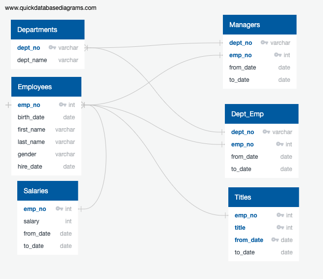

# Pewlett-Hackard-Analysis.

## Project Overview
The purpose of this challenge was to perform a database analysis for the company Pewlett Hackard and extract detailed information about employees of the company who will be retiring or eligible for retirement in the near future. In addition to this, information on possible mentors for future hirees was collected, for the inevitable wave of new hires that will need assistance as they join the company.

## Results
* Shown below is an Entity Relationship Diagram, or ERD, used to help plan and visualize the relationships of the different tables of data in the database.

