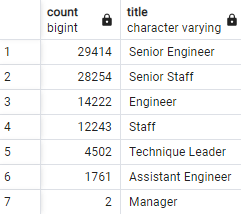
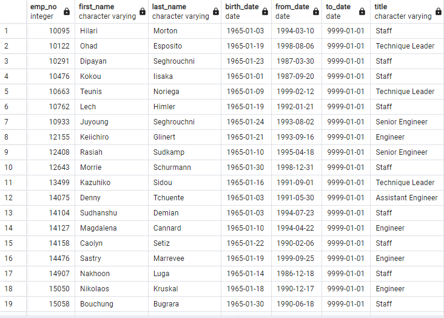

# Pewlett-Hackard-Analysis.

## Project Overview
The purpose of this challenge was to perform a database analysis for the company Pewlett Hackard and extract detailed information about employees of the company who will be retiring or eligible for retirement in the near future. In addition to this, information on possible mentors for future hirees was collected, for the inevitable wave of new hires that will need assistance as they join the company.

## Results
* Shown below is an Entity Relationship Diagram, or ERD, used to help plan and visualize the relationships of the different tables of data in the database.

* When performing a count of the total number of employees approaching retirement eligibility, it became clear that the majority of employees are close to retirement age. As shown below, there are 29,414 Senior Engineers and 28,254 Senior Staff members for a total of 57,668 out of 90,398, or about 64% of total employees. This means that over half of the company is approaching retirement and the company is going to have to be ready to adjust.

* Shown below is the table containing employees eligible for the mentor program for new hires. There are a total of 1,549 employees, born in 1965, who are eligible to be mentors for the new hires. These employees will prove extremely valuable in the coming years as the impending wave of retirement approaches.

* Luckily for the company, only two managerial positions are in danger of losing people to retirement. This will prove beneficial as the Silver Tsunami takes out a lot of senior positions. The stability at the top of the food chain is neccessary for a period of high turnover, like the one Pewlett Hackard is about to face.

## Summary

* As the "Silver Tsunami" of retirement approaches for Pewlett Hackard, there are going to be just shy of 60,000 employee vacancies needing to be filled in the coming years.

* With almost 1600 qualified retiremet candidates that would be eligible to mentor new hires, as long as the number of new hires does not exceed that in a single hiring wave, there should be enough mentors to smoothly transition the company into a new era.

